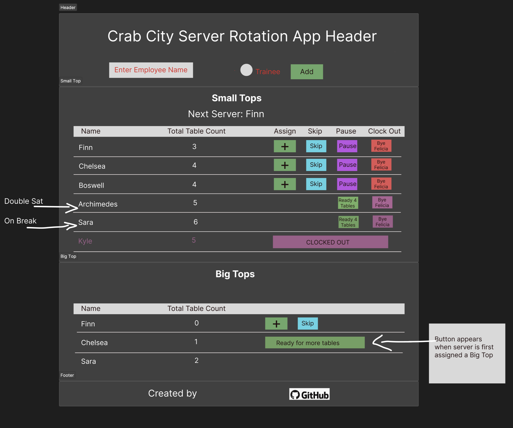

# Server Rotation App
React app managing server rotation schedule for restaurant

## Run app locally
Open terminal at root and enter:

`npm install`

`npm run dev`

Click on link to open in browser

` Local:   http://127.0.0.1:5174/`

## User Story
The current system of using a dry erase board to keep track of which server gets the next table is not efficient, especially during rushes resulting in servers getting skipped, double sat, or overwhelmed. Customers also become frustrated because the servers are not able to provide a good experience, especially to big tops. As a restaurant owner, I want to efficiently keep track of servers and their table assignments so that customers and other servers will have a streamlined experience with little to no confusion on who gets the next table..

## Requirements
- Display the name of the upcoming server at the top of the app
- Dedicate a section to keep track of tables (small tops)
- Dedicate a second section to keep track of big tops (6 or more people)
- A header section that includes an editable input to enter the name of a server
- Optional radio button/check box for a trainee
- Server names will appear in both sections for 'small tops' or 'big tops' if they are not trainees. Trainees will ONLY be able to server 'small tops'
- A running count of tables assigned to a server for the day (small tops/big tops separately)
- Buttons will be next to every server name and disabled until it is that server's turn
- An 'assign' button will increase the table count by one and change the name of the next server to the following name in the list
- A 'skip' button will change the display of the upcoming server and put the previous server to the end of the list
- If assigned to a Big Top - the server will be taken out of rotation until the Big Top has ordered food. At this time the server will click a button when 'Ready for more tables'
- A 'break' button will temporarily take server out of rotation (disable buttons). At that time a button will appear 'Ready for more tables' and can be pressed when the server comes back from break
- There will be a 'Clock out' button to permanently remove server from rotation for the rest of the day
- There will be a 'jump' button - reserved for servers who may have customers request to seat them. 'Jump' feature will skip server in next rotation
- The app will reset at midnight, clearing totals and removing server names 

## Wireframe

