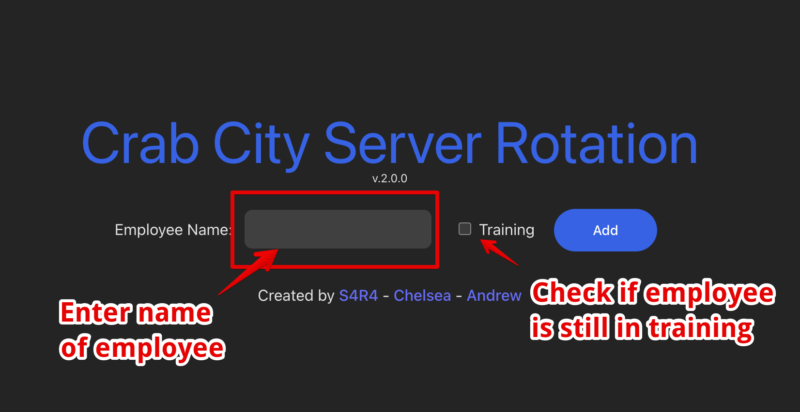
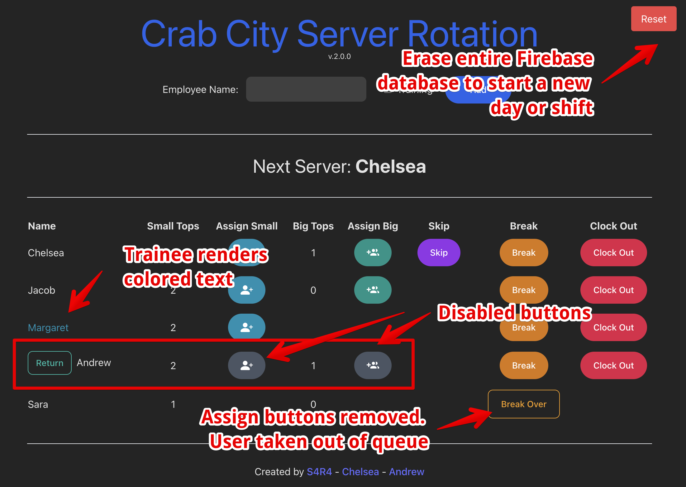
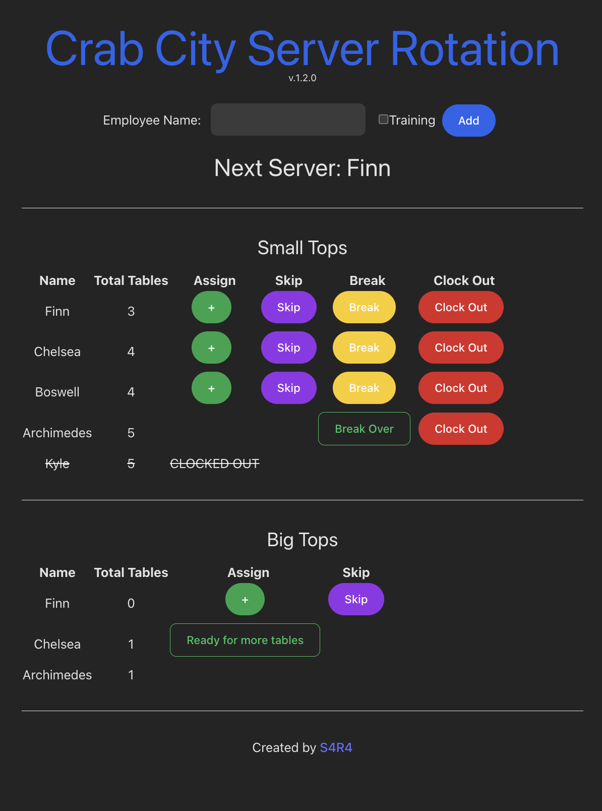
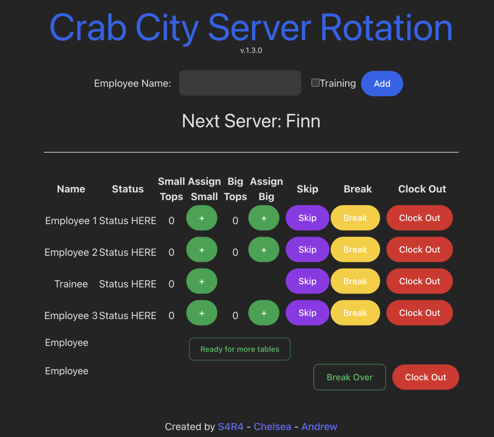

# Server Rotation App
**Crab City Server Rotation** is a modern and efficient solution designed to streamline table rotations for a local restaurant.

 

## Demo
Experience the application live: [Deployed Link](https://crab-city.vercel.app/)

## User Story
The current system of using a dry-erase board for server rotation was not efficient, especially during peak hours, leading to various operational challenges. As a restaurant owner, the need for a digital solution to enhance customer and server experience became evident. This app addresses these challenges.

## Requirements
- The header section includes an editable input to enter the name of a server.
- An optional radio button/check box is available for a trainee.
- The name of the upcoming server is displayed under the header, above the table.
- The names displayed in the table reflect the actual order of the queue. The top row of the table displays the upcoming server information, allowing users to easily see who is next in line. Once a server is assigned a table, they will move to the bottom of the table. If an employee is on a break, they will be placed at the end of the queue until they return.
- There is a table that displays the following information:
  - Name: Employee Name
  - Small Tops: Displays the running count of small tops assigned
   -Assign Small: When pressed, the small top count is incremented by one, and the employee is moved to the back of the queue.
  - Big Tops: Displays the running count of big tops assigned. This will not appear for trainees.
  - Assign Big: When pressed, the big top count is incremented by one, and the employee is disabled to account for the time needed to handle a large party. A new 'Ready' button will appear before the employee's name. The Small and Big Assign buttons will be disabled. The Employee will hold their spot in the queue until they are ready to be assigned more tables. 
  - Skip: When pressed, the employee is moved to the back of the queue.
   -Break: When pressed, the employee is taken out of the queue (paused). A new button 'Break Over' will appear, while the Small/Big Assign and Skip buttons are removed.
  - Clock Out: When pressed, the employee will be prompted to make SURE user meant to press button. Once confirmed, the employee will be removed from the table completely.
- When employees are ready for more tables or are back from break, they can press the 'Return' or 'Break Over' button, which will make them the next employee in the queue.
- The app will have a backend, so all instances of the app will be up-to-date on any iPad used at the restaurant (Firebase implementation).
- The app will have the functionality to clear all employees from the database at once

## Run app locally
1. Clone the repository and navigate to the root directory.
2. Install dependencies: `npm install`

3. Start the development server: `npm run dev`

4. Open the application in your browser:
[http://127.0.0.1:5174/](http://127.0.0.1:5174/)

## Additional Screenshots
#### Add an Employee

#### Breakdown of table features

## Wireframe

<!--   -->
<!--  -->

## Contact Us

| Profile Photo | Name |
|---------------|------|
|  | [Sara Baqla](https://github.com/missatrox44) |
|  | [Chelsea Sexton](https://github.com/chelsea314) |
|  | [Andrew Cooke](https://github.com/andcooke) |
