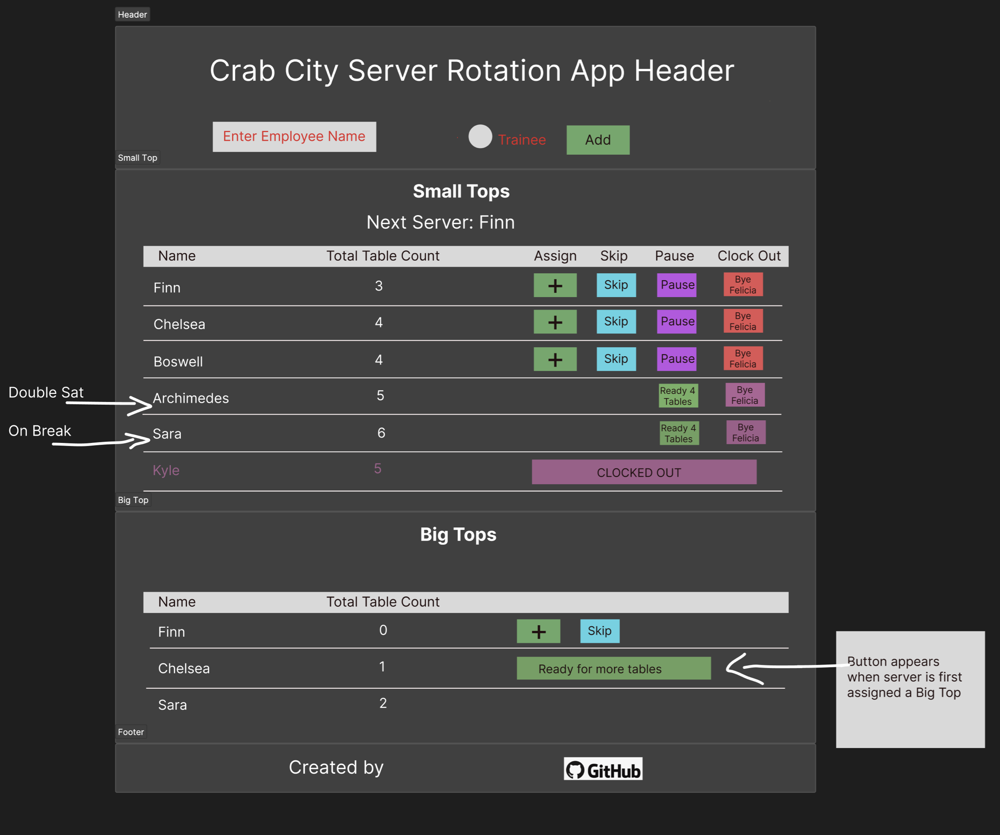

   
  <h1>Server Rotation</h1>
  <strong>Crab City - Odessa</strong>

 

 
  
  
  
  
  

## What is Server Rotation?

**Server Rotation** is a modern and efficient solution designed to streamline table rotations for employees at local restaurant, Crab City.

Experience the application live: [Deployed Link](https://crab-city.vercel.app/)

## Table of Contents

- [What is Server Rotation?](#what-is-server-rotation)
- [Demonstration](#demonstration)
- [User Story](#user-story)
- [Key Features](#key-features)
  - [Add a Server](#add-a-server)
  - [View Next Available Server](#view-next-available-server)
  - [Server Queue](#server-queue)
  - [Server Table](#server-table)
    - [Name](#name)
    - [Small Tops](#small-tops)
    - [Assign Small](#assign-small)
    - [Big Tops](#big-tops)
    - [Assign Big](#assign-big)
      - [Return](#return)
    - [Skip](#skip)
    - [Break](#break)
      - [Break Over](#break-over)
    - [Clock Out](#clock-out)
  - [Reset](#reset)
- [Installation](#installation)
- [Screenshots & Usage](#screenshots--usage)
  - [Add Server](#add-server)
  - [Breakdown of Table Features](#breakdown-of-table-features)
- [Wireframe](#wireframe)
- [Contact](#contact-us)

## Demonstration

## User Story

At local Odessa restaurant, Crab City, the current system of using a dry-erase board for server rotation was not efficient, especially during peak hours, leading to various operational challenges.

As a restaurant owner, the need for a digital solution to enhance customer and server experience became evident. [Server Rotation](https://crab-city.vercel.app/) addresses these challenges and provides employees with an efficient system to keep track of table rotation.

## Key Features

### **Add a Server**

- Input name of server
- Optional radio button for server-in-training
- Upon submit, server is added to end of queue

### **View Next Available Server**

- Name of next available server displays below input
- Does not display servers who are disabled or on-break

### **Server Queue**

- Table reflects order of queue with next server displaying at top
- Once server is assigned a table, they are moved to end of queue
- Servers on-break are removed from queue and placed at bottom of table

### **Server Table**

#### Name

- Displays server name
- Server-in-training displays in blue

#### Small Tops

- Displays running count of small top tables assigned during current shift

#### Assign Small

- When pressed, small top count is incremented by one
- Server moved to end of queue

#### Big Tops

- Displays running count of big top tables assigned during current shift
- Does not appear for server-in-training as they are not ready to handle larger parties yet

#### Assign Big

- When pressed, big top count is incremented by one
- Server moved to end of queue
- Server 'disabled' to account for the time needed to manage a large party
- 'Return' button appears before server's name
- Assign buttons for both small and big tops temporarily disabled
- Server maintains position in queue
- #### **_Return_**
  - When ready, server selects 'Return' button and resumes position in queue
  - Disabled server status removed
  - Assign big and small buttons regain functionality

#### Skip

- When pressed, server is moved to end of queue

#### Break

- When pressed, server removed from queue temporarily
- Server moved to end of table
- 'Break Over' button appears
- Assign and skip buttons removed
- #### **_Break Over_**
  - When pressed, server returns to end of queue
  - Assign and skip buttons reappear

#### Clock Out

- When pressed, server prompted to confirm selection
- Server removed from table and database

### **Reset**

- When pressed, user prompted to confirm selection
- Clears all servers from table and database

## Installation

1. Clone the repository and navigate to the root directory.
2. Install dependencies: `npm install`

3. Start the development server: `npm run dev`

4. Open the application in your browser:
   [http://127.0.0.1:5174/](http://127.0.0.1:5174/)

## Screenshots & Usage

#### Add Server

#### Breakdown of Table Features

## Wireframe

## Contact Us

[ <a href="https://github.com/missatrox44">Sara Baqla</a>](https://github.com/missatrox44)

[ <a href="https://github.com/chelsea314">Chelsea Sexton</a>](https://github.com/chelsea314/)

[ <a href="https://github.com/andcooke">Andrew Cooke</a>](https://github.com/andcooke/)
